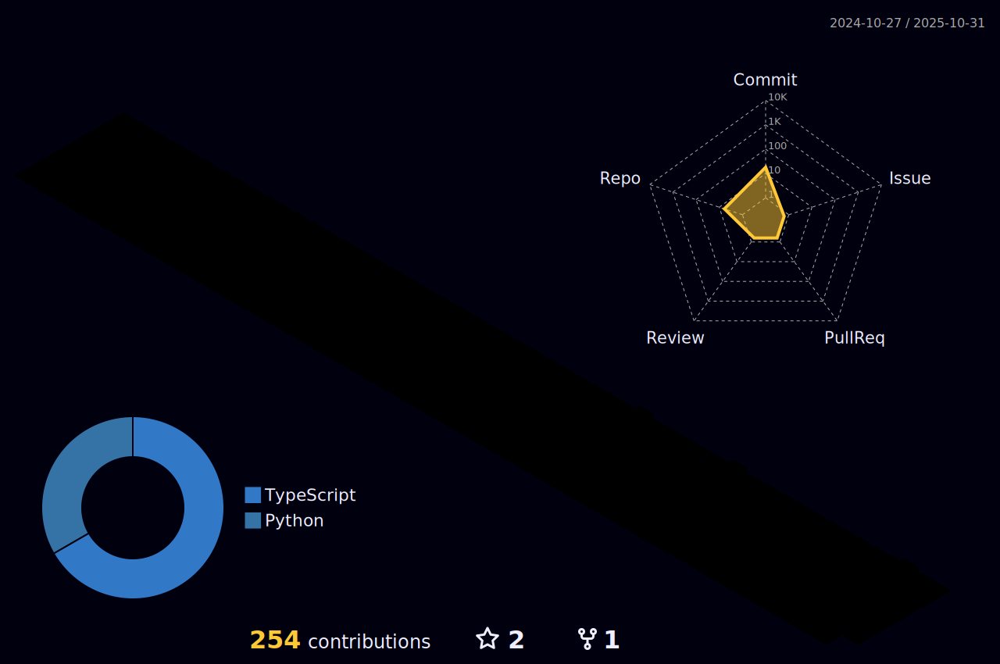

<p align="center">
  
</p>

<div align="center" >
<h1> ABOUT ME</h1>
 </div>

```yaml
name: Shashank Bhatnagar
located_in: Lucknow , Uttar Pradesh
education:
  [
    "Self-Taught Developer",
    "A Full-Stack Developer worked on technologies like NextJs, ReactJs, MongoDB ,PostgresSQL,Prisma, etc"
    "Bachelor's in Computer Engineering",
  ]


fields_of_interests:
  [
    "Web Development",
    "UI/UX",
    "DevOps"
  ]

currently_learning: ["NextJs"  , "Redis"]
```

<div align="center" >
<h1> CONNECT WITH ME</h1>
 </div>

[](mailto:shashank.bhatnagar3@gmail.com)
[](https://www.linkedin.com/in/shashank-bhatnagar-874247216/) [](https://leetcode.com/u/Shashank_bhatnagar03) [](https://codeforces.com/profile/Shashank_bhatnagar03)

<div align="center" >
<h1>  TECH STACK</h1>
 </div>
 
                    

<div align="center" >
<h1>  GITHUB STATS</h1>
 </div>
 <div align="center">
 <p></p>
<hr>
 </div>


<div align="center" >
<h1> CONTRIBUTIONS</h1>
 </div>

<div align="center">

</div>

<p align="center">
   
</p>
